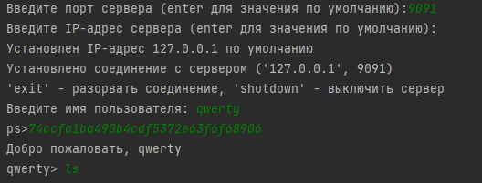

# FTP-сервер
Лабораторная работа № 7

## Работа FTP-сервера и клиента

- ls (посмотреть содержимое текущей директории)

- cat (посмотреть содержимое)

- mkdir, rmdir (создать директорию, удалить директорию)

- cd, cd .. (переместиться в директорию, подняться вверх)

- copy from server (копирование из сервера в клиент)

- copy to server (копирование от клиента на сервер)

- shutdown (выключить сервер)

