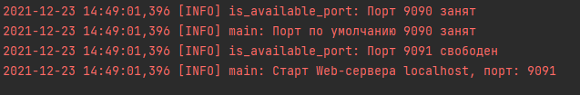
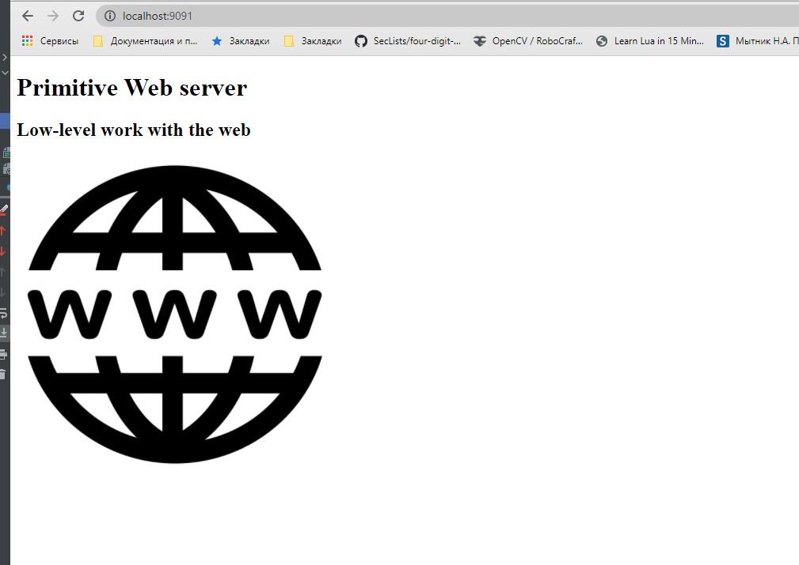
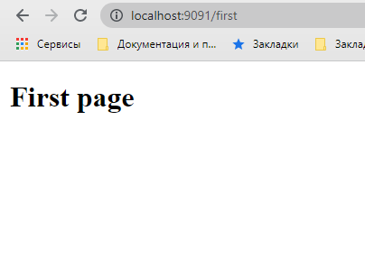
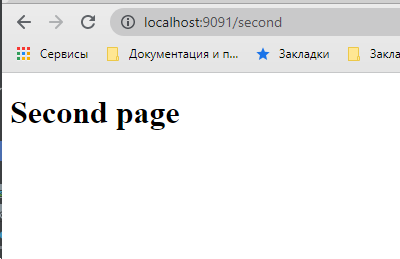
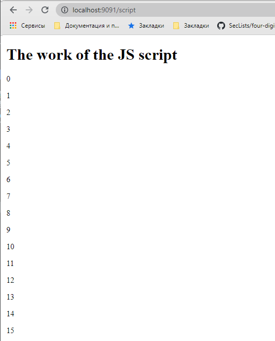
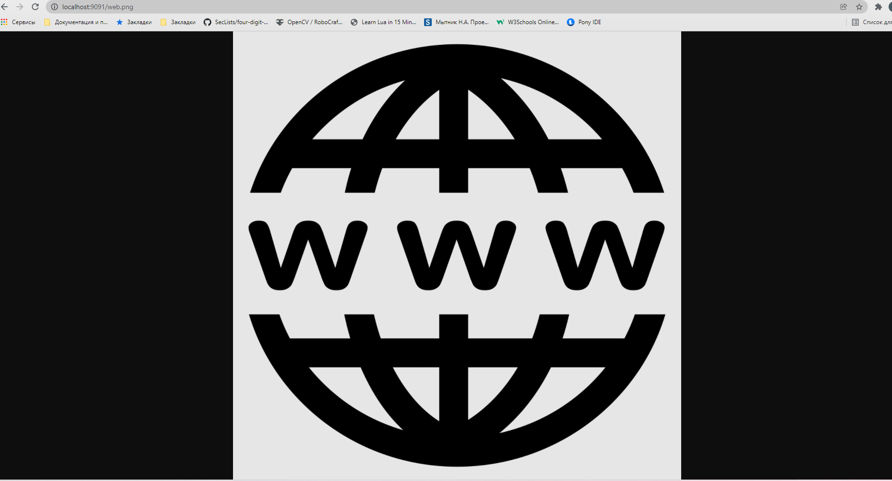
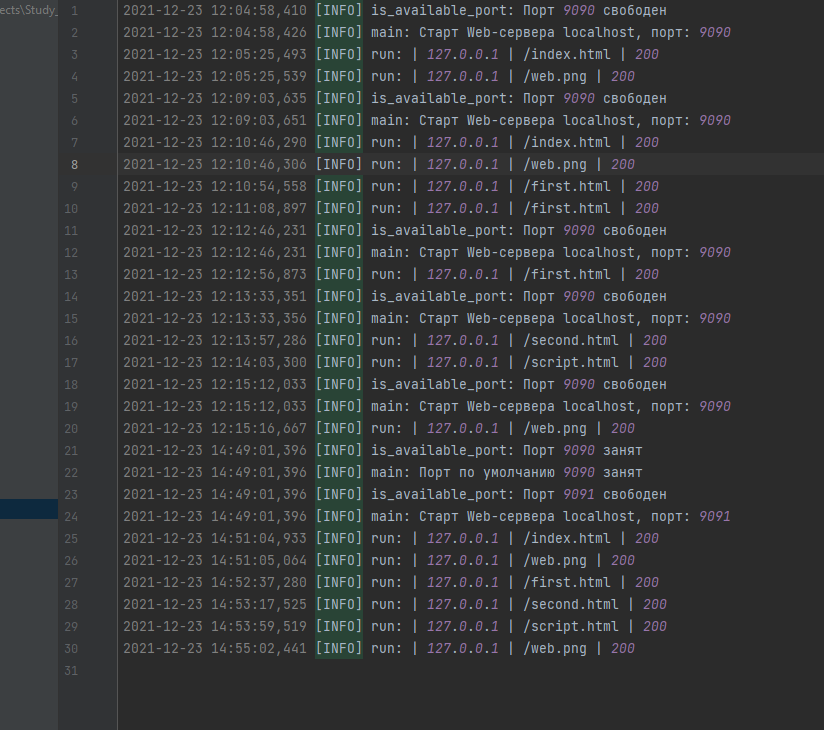

# Web-сервер
Лабораторная работа № 6
[“Низкоуровневая работа с веб”](https://github.com/fa-python-network/6_Web_server)

## Работа Web-сервера
- Старт

- Информация о запросе в терминале

- Главная страница (http://localhost:9091)

- Первая страница (http://localhost:9091/first)

- Вторая страница (http://localhost:9091/second)

- 
- Страница с JS-скриптом (http://localhost:9091/script)

- Страница с png картинкой (http://localhost:9091/web.png)

- Логи веб-сервера

